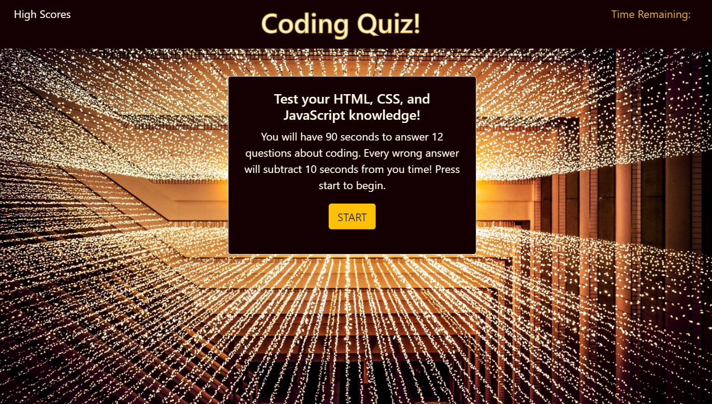
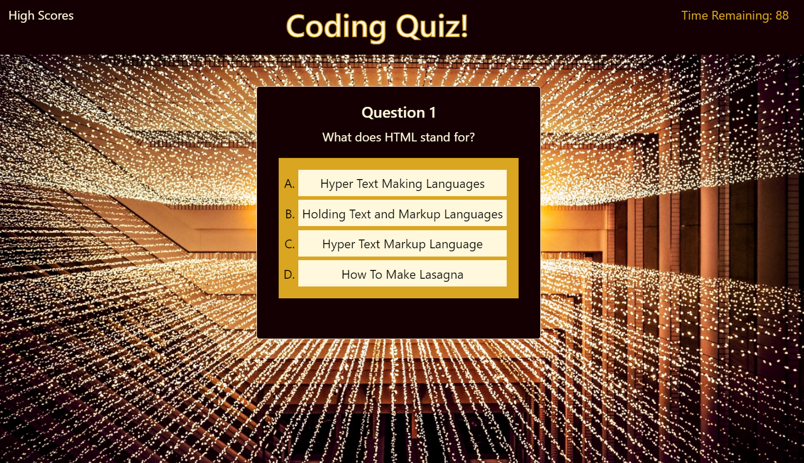
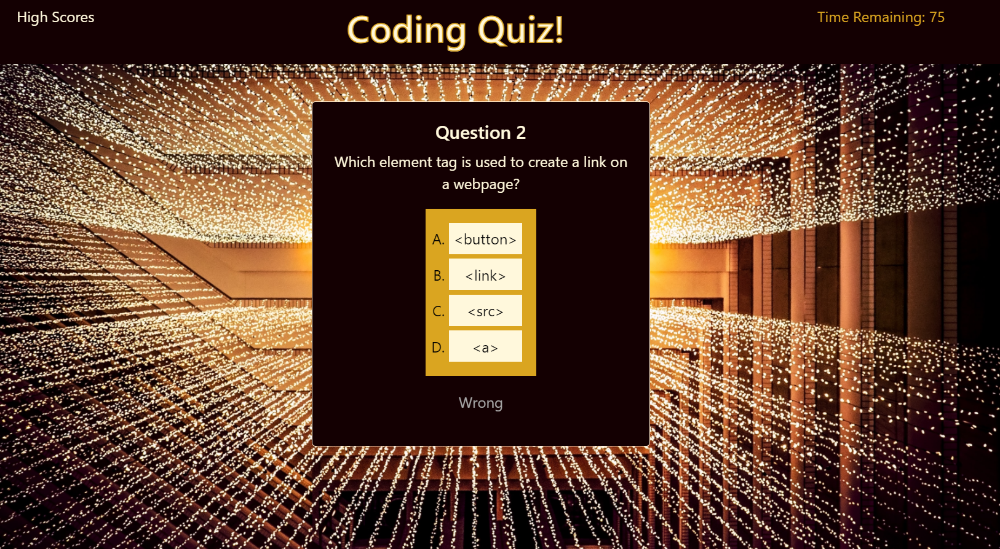
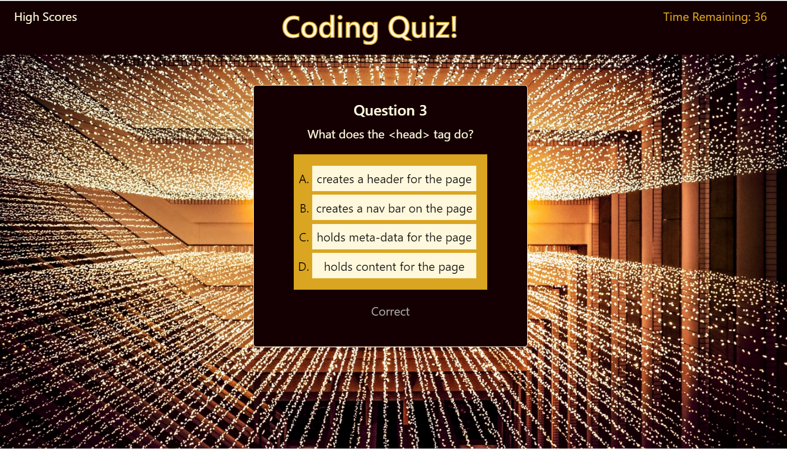
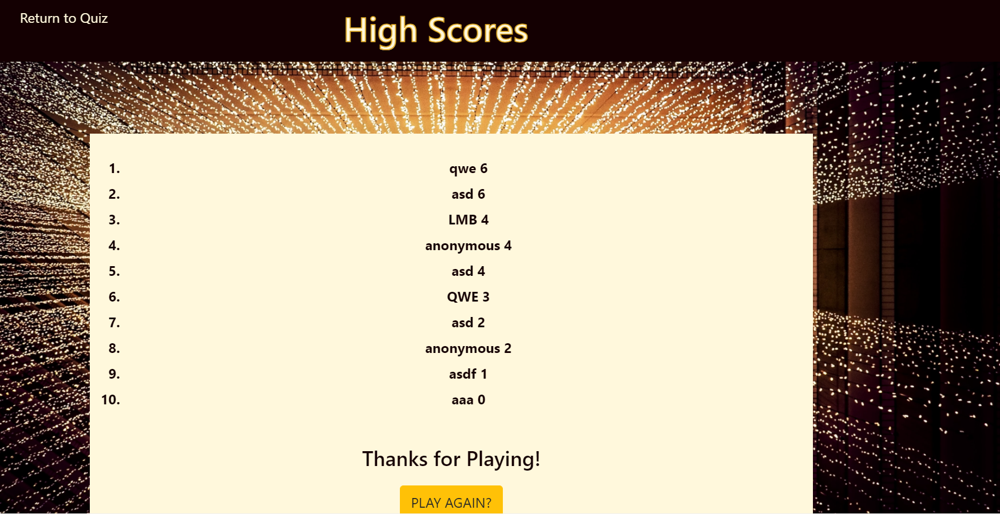

# 4-web-apis-code-quiz

A project to demonstrate my knowledge of Web APIs through a quiz about coding.


## User Story

```
AS A coding boot camp student
I WANT to take a timed quiz on coding fundamentals that stores high scores
SO THAT I can gauge my progress compared to my peers
```
## Purpose and Scope

The website is designed to allow the user to take a short quiz about coding knowledge. The quiz is 12 questions long and the user has 90 seconds to answer all of them. 10 seconds are deducted from this time for every wrong answer. At the end of the quiz the user has the option to input their initials, which will be displayed on the high scores page along with their score. On the high scores page, the scores are ranked highest to lowest. 

The high scores page uses local browser storage to store user scores. As such, the user can only see their rank in comparison with other quizes taken on the same browser. Further this feature is limited to computer usage as mobile devices store browser information differently.


## Installation

No installation is required. This is a web-based ap. Click here to access it:
https://lasettebrown.github.io/4-web-apis-code-quiz/

## Instructions

When the site loads the user will be presented with the instructions page.



Clicking on 'High Scores' will take the user directly to the high scores page.
Clicking on the 'START' button will start the quiz. The user will be presented with a multiple choice question with four possible answers.



Select an answer by clicking on it. Once an answer is selected, the quiz will display whether that answer was 'Correct' or 'Wrong' and move on the the next question.




Once the user has answered all 12 questions, or if the timer runs out, the quiz is over. A window alert will display showing the user score. Then a prompt will ask for the user's initials, and the page will be redirected to the High Scores page.

The users initials will be displayed alongside their score, ranked among all quiz scores.



Clicking on either 'Return to Quiz' or the 'PLAY AGAIN?' button will redirect the user back to the quiz page.

## Built with

HTML
CSS
Bootstrap
JavaScript

## Authors

All pages of this site were written by Lasette brown. Bootstrap was used for certain design elements. The background image is by Joshua Sortino and was obtained through Unsplash. Find Joshua Sortino's profile page here: https://unsplash.com/@sortino?utm_source=unsplash&utm_medium=referral&utm_content=creditCopyText


## Thank yous

Thank you to my tutor, Kelly Gowing, and my friend, Eliot Kurfman for helping me debug mycode!

## License

The content of this website is copyrighted. Please do not use the content without permission.
© 2021 Lasette Brown. All Rights Reserved.


